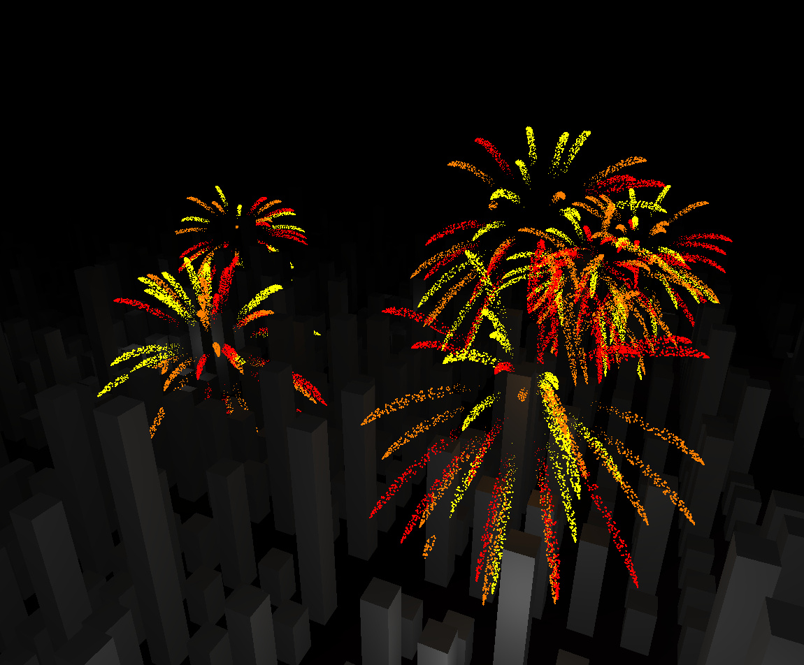
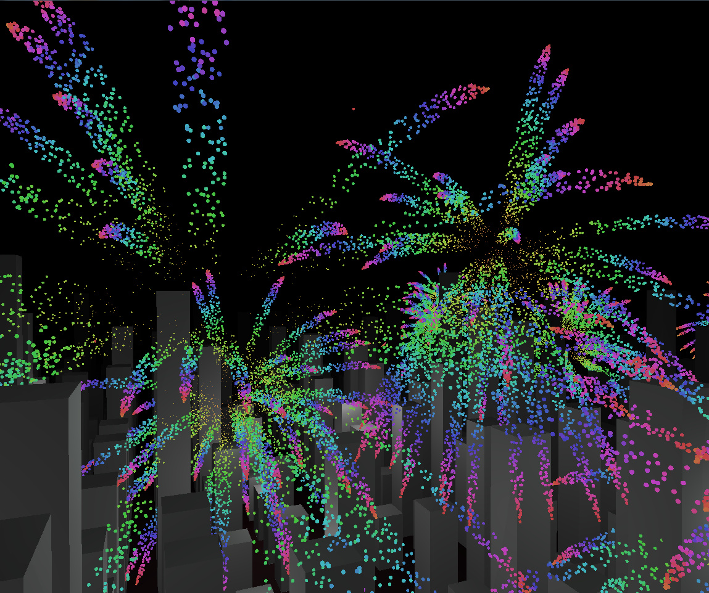
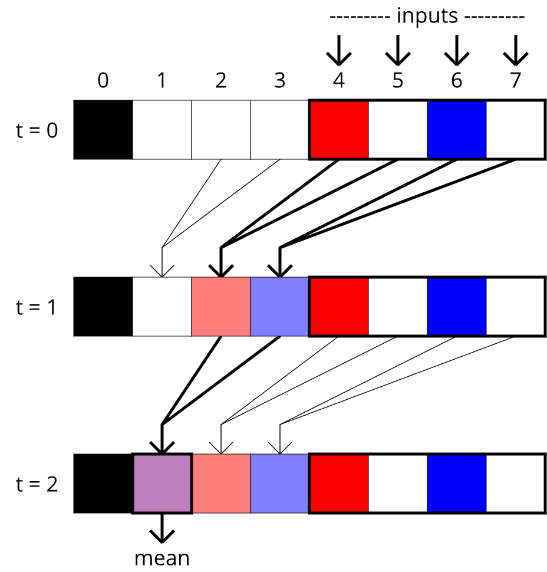

# Fireworks

My team's final project for our Graphics class was a real-time scene with fireworks over a randomly generated infinite city, with a custom lighting system and a controllable camera.

I worked mainly on the fireworks for this project, writing GLSL code for the GPU. Each firework has 2^13 = 8192 particles, and their positions and colors are all averaged to create lights in real time. Additional color and position buffers are used to hold binary trees of averages, sort of like a heap. Particle information takes 13 frames to percolate down the tree to the root overall average, but this is extremely efficient on the GPU. 

Note in the pictures that particles exist in the space of the scene as opposed to being a 2D overlay. As such, they can be occluded by the buildings and light up the buildings with the correct color and direction.

<iframe width="560" height="315" src="https://www.youtube.com/embed/I0JobHULJiE?rel=0" frameborder="0" allow="autoplay; encrypted-media" allowfullscreen></iframe>

(Sound on!)

